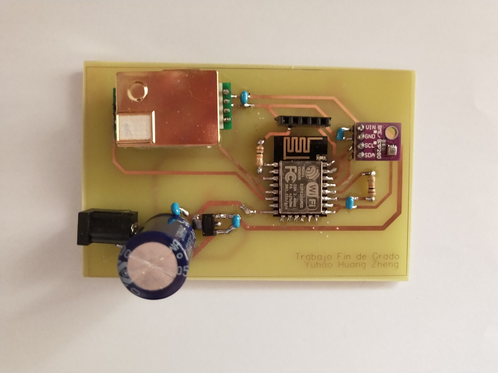

# Smart CO2 Sensor with Wireless Communication 🌡️



## Overview 📋

This project implements a smart CO2 sensor system with wireless communication capabilities designed for indoor environments. The system continuously monitors CO2 concentration, temperature, and humidity levels, transmitting the data wirelessly to a central server where it can be visualized through a user-friendly dashboard. The solution also includes an automated alert system that notifies users via email or Telegram when CO2 levels exceed predefined thresholds (1500 ppm).

The project consists of a custom-designed PCB integrating an ESP-12E module with MHZ-19B CO2 sensor and BME280 temperature/humidity sensor, communicating with a Raspberry Pi that serves as the central hub for data processing and visualization.

## Project Goals 🎯

- ✅ Design a device capable of measuring CO2 concentrations in indoor spaces using the MHZ-19B sensor
- ✅ Implement wireless data transmission using MQTT protocol for real-time monitoring
- ✅ Create a user-configurable system that allows parameter adjustment without reprogramming
- ✅ Develop a visualization interface using Node-RED for real-time data monitoring
- ✅ Set up an automated alert system for when CO2 levels exceed recommended thresholds
- ✅ Design and manufacture a compact prototype integrating all components

## Technologies Used 🛠️ 

### Hardware
- **ESP-12E Module**: Main microcontroller
- **MHZ-19B Sensor**: CO2 measurement (0-5000 ppm range)
- **BME280 Sensor**: Temperature and humidity measurement
- **Raspberry Pi 3 Model B+**: Central server hosting MQTT broker and Node-RED

### Communication Protocols
- **UART**: Communication between ESP-12E and MHZ-19B sensor
- **I²C**: Communication between ESP-12E and BME280 sensor
- **MQTT**: Wireless data transmission protocol
- **WiFi**: Network connectivity

### Software & Development Tools
- **Arduino IDE**: Firmware development environment
- **EasyEDA**: PCB design software
- **Node-RED**: Flow-based development tool for visualization and alerts
- **Mosquitto**: MQTT broker implementation

## Features 📊 

- Real-time monitoring of CO2, temperature, and humidity
- Remote sensor activation/deactivation
- Email and Telegram alerts when CO2 levels exceed 1500 ppm
- Web-based configuration portal for easy setup
- Responsive visualization dashboard
- Expandable system architecture

## System Architecture 📡

```
┌──────────────────┐         ┌─────────────────┐         ┌─────────────────┐
│  Sensor Module   │  WiFi   │  Raspberry Pi   │  HTTP   │    End User     │
│  (ESP-12E)       │◄──────► │  (MQTT Broker   │◄──────► │    Interface    │
│  CO2, Temp, Hum  │  MQTT   │   & Node-RED)   │  Email  │  (Web Browser)  │
└──────────────────┘         └─────────────────┘ Telegram└─────────────────┘
```
